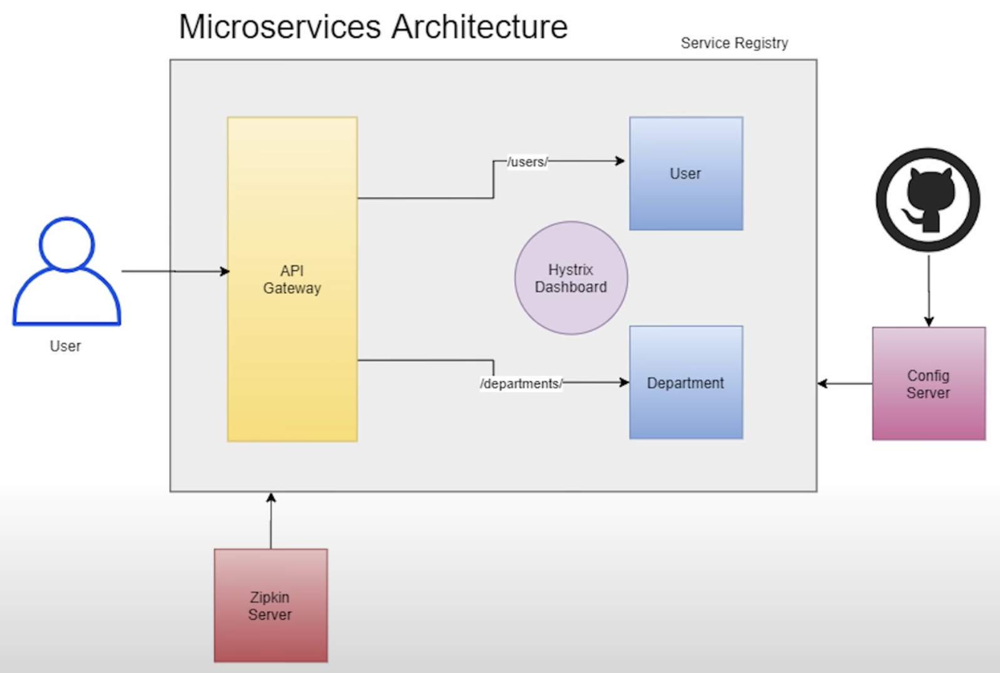

# SpringBoot Microservices and their interaction

<b>Technologies Used : </b>

To create Microservices : SprintBoot 2.3.9 version 

Service Registry : Eureka Server (Netflix) 

API Gateway : Spring Cloud Gateway 

Circuit Breaker : Hystrix, Hystrix Dashboard (Netflix) 

Config Server : Spring Cloud Config Server 

Logs Tracing : Zipkin and Sleuth

<b>Running Zipkin server: </b>

java -jar zipkin-server-2.23.2-exec.jar

Once the application is started with Sleuth and Zipkin server is started then the logs will automatically flow in and 
appear in Zipkin dashboard.
 

<b>Order of apps start up: </b>

Config Server

Service Registry

API Gateway

User Service

Department Service

Hystrix Dashboard

<b>Project Mindmap</b>

Credits to : https://youtu.be/BnknNTN8icw

TODO:
1. Should Config server which gets the Eureka server info from Git also connect to Eureka as Client??
2. Implement Redis Cache In Spring Boot Application : https://javatechonline.com/how-to-implement-redis-cache-in-spring-boot-application/

